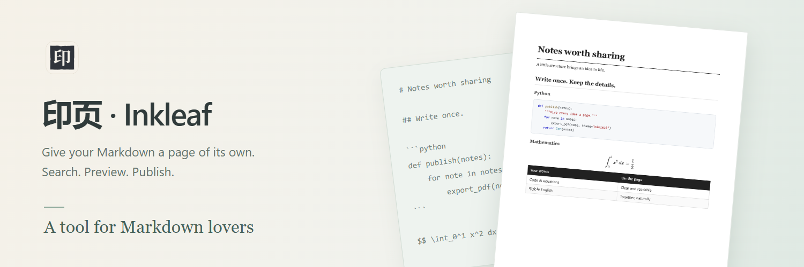

<p align="center">
  <picture>
    <source media="(prefers-color-scheme: dark)" srcset="docs/media/hero-en-dark.png">
    
  </picture>
</p>

<p align="center">
  <a href="https://github.com/alextianyf/Inkleaf/releases/download/v0.5.0/Inkleaf-Setup-0.5.0.exe"><picture><source media="(prefers-color-scheme: dark)" srcset="docs/media/badges/download-en-dark.svg"></picture></a>&nbsp;&nbsp;<a href="#quick-start"><picture><source media="(prefers-color-scheme: dark)" srcset="docs/media/badges/quick-start-en-dark.svg"></picture></a>
</p>

<p align="center">
  <picture><source media="(prefers-color-scheme: dark)" srcset="docs/media/badges/system-windows-en-dark.svg"></picture>&nbsp;&nbsp;<a href="LICENSE"><picture><source media="(prefers-color-scheme: dark)" srcset="docs/media/badges/free-en-dark.svg"></picture></a>
</p>

<p align="center">
  <sub>by <a href="https://github.com/alextianyf"><strong>Alex Tian</strong></a> &nbsp;·&nbsp; <strong>English</strong> · <a href="README.zh-CN.md">简体中文</a> &nbsp;·&nbsp; <a href="docs/todo.md">Roadmap</a> &nbsp;·&nbsp; <a href="https://github.com/alextianyf/Inkleaf/issues">Feedback</a></sub>
</p>

## A small space for your next PDF

Inkleaf is a Windows desktop tool for turning Markdown notes, project READMEs and technical documents into PDFs. A shortcut brings up the search bar. Find a file, check the finished pages, and export. No account, subscription or document upload.

**Language support:** The interface is available in English and Simplified Chinese. Markdown documents and exported PDFs support English, Chinese, and mixed Chinese–English text.

[](docs/media/demo-en.png)

<p align="center"><sub>Recorded in the real app with a sample document. <a href="docs/media/demo-en.png">View a still image</a>.</sub></p>

## What you can do

| Task                    | How it works                                                                                                                                                 |
| ----------------------- | ------------------------------------------------------------------------------------------------------------------------------------------------------------ |
| **Find a document**     | Search part of a filename or path. Results distinguish Markdown files from folders containing Markdown.                                                      |
| **Check before saving** | Preview the generated PDF, including page breaks and clickable contents. Export uses those same PDF bytes.                                                   |
| **Keep the details**    | Render mathematics, tables, images, aligned badges, task lists and footnotes. Missing resources and some unsupported content produce notices.                |
| **Convert a folder**    | Select Markdown files for batch export and inspect them individually. Preserve subfolders; automatic output adds numbers to avoid overwriting existing PDFs. |
| **Choose the layout**   | Folio (default), Classic and Minimal themes, A4 or Letter, typography, heading styles, pagination, headers, footers and copyright.                           |
| **Set app appearance**  | Choose Light, Dark or System in General. App appearance stays independent of your PDF theme.                                                                 |
| **Keep it local**       | Convert without changing the Markdown source. Save to Downloads, beside the source, or in a folder you choose.                                               |

## Why Inkleaf?

- **Free for personal, noncommercial use.** No subscription, conversion credits or account required for that use. Business and other commercial use require separate written permission; fees are negotiated separately. [License](LICENSE).
- **Nothing leaves your computer.** Conversion runs locally and leaves the Markdown source unchanged. Local resources and bundled mathematics work offline; only remote images and update checks need a connection.
- **Fast filename search.** A recorded Windows benchmark measured about **23 ms median query time for 100,000 indexed Markdown files**. Initial scanning, startup and displaying results are separate. [Measurements and limits](docs/search.md).
- **A small interface, a short workflow.** Bring up the search bar, choose a file and preview. Inkleaf stays in the system tray between uses.

## Markdown, on paper

These comparisons pair the **literal Markdown source** with **PDFs generated by Inkleaf**, using the Minimal theme, A4 paper and 10.5 pt body text. Only blank page margins are cropped from the images. Click a comparison to enlarge it; download the PDF to try its links.

### Headings and text

All six heading levels, **bold**, _italic_, strikethrough, bilingual text and a blockquote.

[](docs/media/examples/typography.png)

[Markdown source](docs/demo/examples/typography.md) · [Actual PDF](docs/media/examples/typography.pdf)

### Code and mathematics

Code preserves its text and indentation, with language-specific syntax highlighting. KaTeX renders inline formulas, integrals and fractions.

[](docs/media/examples/code-math.png)

[Markdown source](docs/demo/examples/code-math.md) · [Actual PDF](docs/media/examples/code-math.pdf)

### Tables and lists

Left-, center- and right-aligned table columns, checked and unchecked tasks, numbered steps and nested bullet lists. Task checkboxes are static in the PDF.

[](docs/media/examples/tables-lists.png)

[Markdown source](docs/demo/examples/tables-lists.md) · [Actual PDF](docs/media/examples/tables-lists.pdf)

### Images, badges and links

A local image and SVG badge follow their paragraph's center alignment. The PDF includes an internal jump, an external link, and a footnote with a return link.

[](docs/media/examples/images-links.png)

[Markdown source and local images](docs/demo/examples/) · [Actual PDF](docs/media/examples/images-links.pdf)

These are examples of supported content, not a promise of every Markdown dialect. See the [compatibility guide](docs/engine.md) for unsupported extensions and layout limits.

## Get Inkleaf

**[Download for Windows (x64)](https://github.com/alextianyf/Inkleaf/releases/download/v0.5.0/Inkleaf-Setup-0.5.0.exe)** · [Release notes](https://github.com/alextianyf/Inkleaf/releases/tag/v0.5.0)

The current stable release is **0.5.0**. Download the `.exe` installer above, or [run from source](#development). The `.blockmap` and `latest.yml` files on the release page are used by the updater; manual installation only needs the `.exe`.

The installer bundles the runtime, so Node.js and Python are not needed. macOS and Linux builds are not currently offered, and Windows builds are unsigned. Folio, advanced layout settings, code highlighting and Light/Dark/System appearance are included in 0.5.0.

Installed Windows builds check for new stable versions. You choose **Download**, then **Restart and update** when ready. Inkleaf waits for active conversion or export tasks; quitting normally does not install an update. [Update and release details](docs/updates.md).

<a id="quick-start"></a>

## Make your first PDF

1. Launch Inkleaf and press **Ctrl + Shift + Space**.
2. Type part of a Markdown filename. Select a result and press **Enter**.
3. Review the PDF, then click **Export PDF**. The default destination is Downloads.

Choose a folder result to prepare a batch. Use **Esc** to dismiss the search bar. Right-click the **system tray icon** to open Settings or quit the app.

Settings are grouped into **General, Search, Layout, Export, and About & updates**. Layout uses a fixed sample document for its live preview. Ordinary settings save automatically; Layout requires Save layout and prompts before leaving unsaved changes. [All settings](docs/settings.md).

## A few things to know

<details>
<summary><strong>What does search look through?</strong></summary>

Local Markdown filenames and paths, plus folders containing indexed Markdown. The first scan takes time; results appear as files are discovered. Add folders or exclude locations in Settings. Search does not yet include document contents, pinyin or typo correction.

</details>

<details>
<summary><strong>Does conversion work offline?</strong></summary>

Yes, for documents using local resources. Mathematics and fonts needed for formulas are bundled. Remote images and badges need a connection when fetched, and update checks contact GitHub. The document itself is not uploaded for conversion.

</details>

<details>
<summary><strong>Will every Markdown extension render?</strong></summary>

Inkleaf supports common Markdown and selected extensions, including KaTeX math and footnotes. Mermaid, PlantUML, Obsidian wiki links are not implemented. Complex HTML/CSS, very wide tables and formulas may need adjustments. [Supported formats and limits](docs/engine.md).

</details>

<details>
<summary><strong>Will Inkleaf change my source files?</strong></summary>

No. Conversion reads your Markdown. Limited formatting recovery happens in memory and reports what changed; it is not a universal Markdown fixer. [Source checks](docs/source-checks.md).

</details>

## Behind the name

A printing block can be used again and again. So can a Markdown document.

Inspired by traditional Chinese printing, **印页** brings together the act of printing and the finished page. **Inkleaf** pairs _ink_ with _leaf_, a sheet of paper. Keep writing in Markdown; make a PDF whenever it is ready to share.

## Still taking shape

The conversion workflow is implemented; the desktop experience is still being refined. Version 0.5.0 includes symmetric resizing, a larger layout preview and clear save/change feedback. Further PDF styling, search, conversion speed and code-maintenance improvements are on the [roadmap](docs/todo.md).

If something renders incorrectly, [open an issue](https://github.com/alextianyf/Inkleaf/issues) with the app version, Windows version, a small Markdown example and the expected result. Remove private information before sharing a sample.

## License

Copyright © 2026 **Alex Tian**. Inkleaf uses a custom [Personal Noncommercial License](LICENSE), not MIT. Personal use without financial benefit or commercial advantage is free. Internal business use, paid teaching, resale and paid services require prior written authorization, with fees agreed separately.

Your documents and generated PDFs remain yours; the license does not require a watermark. Third-party components retain their own licenses. For authorization, use the contact channels on [Alex Tian's profile](https://github.com/alextianyf).

<a id="development"></a>

## Built with

**Electron and React** for the desktop app, **Markdown-it** for parsing, **KaTeX** for mathematics, **Chromium** for PDF generation, **PDF.js** for preview, and **highlight.js** for code colors. Updates use **electron-updater** and GitHub Releases.

To run the desktop version locally, install Node.js 22.12 or newer, then:

```sh
git clone https://github.com/alextianyf/Inkleaf.git
cd Inkleaf
npm ci
npm run dev
```

This starts **Inkleaf Dev** with separate settings and the default shortcut **Ctrl + Alt + Shift + Space**, so it can run alongside the installed app. In PowerShell, use `npm.cmd` if `npm` is blocked by script policy.

The desktop version is available on `main`. The earlier app is preserved on `aldusV1`. [Command cheat sheet (中文)](docs/commands.md) · [Development and builds](docs/development.md) · [Project structure](docs/architecture.md).

---

<p align="center">
  <sub>印页 · Inkleaf · 让文字成页。</sub><br>
  <sub><a href="resources/icons/README.md">Brand assets</a> · <a href="docs/engine.md">Markdown support</a> · <a href="https://github.com/alextianyf/Inkleaf/issues">Report an issue</a></sub>
</p>
