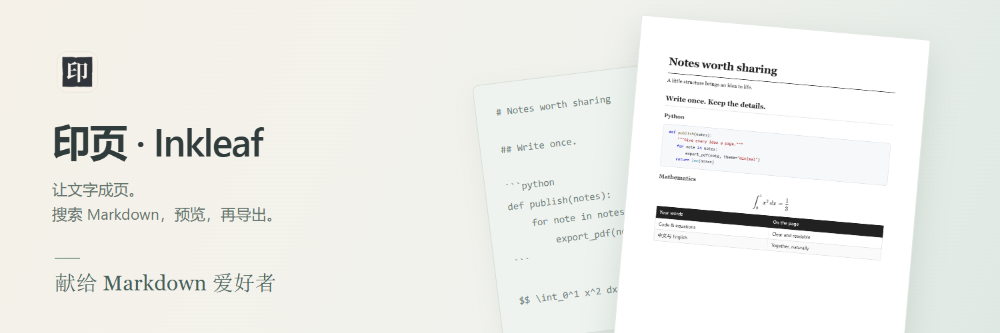
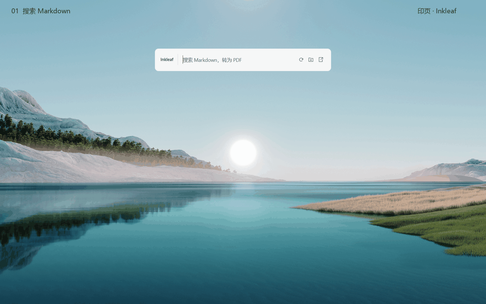
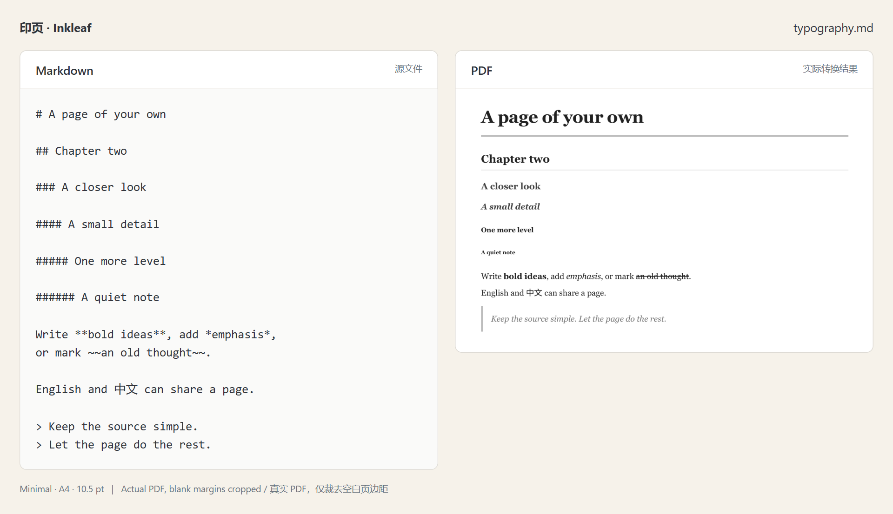
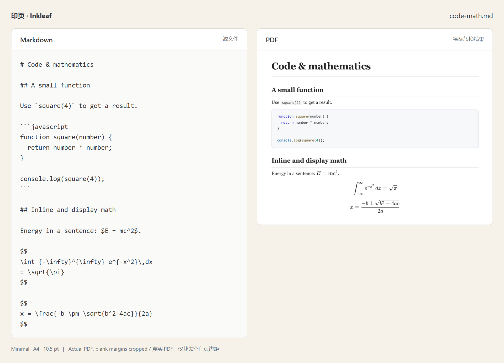
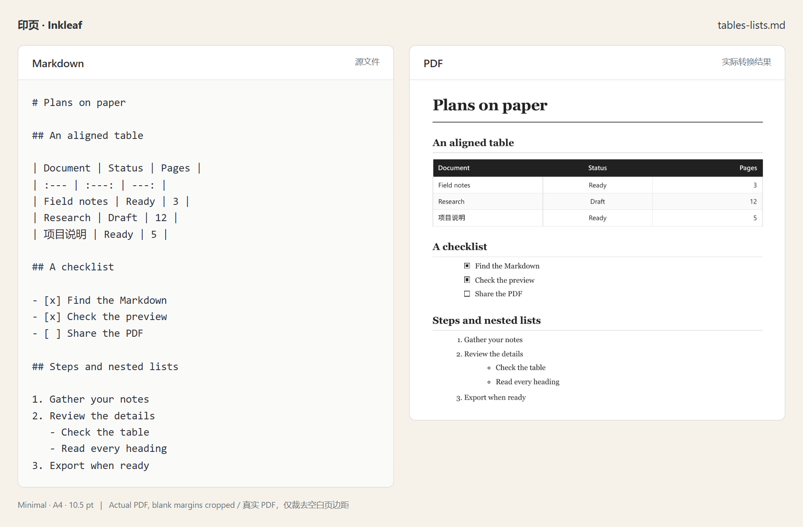
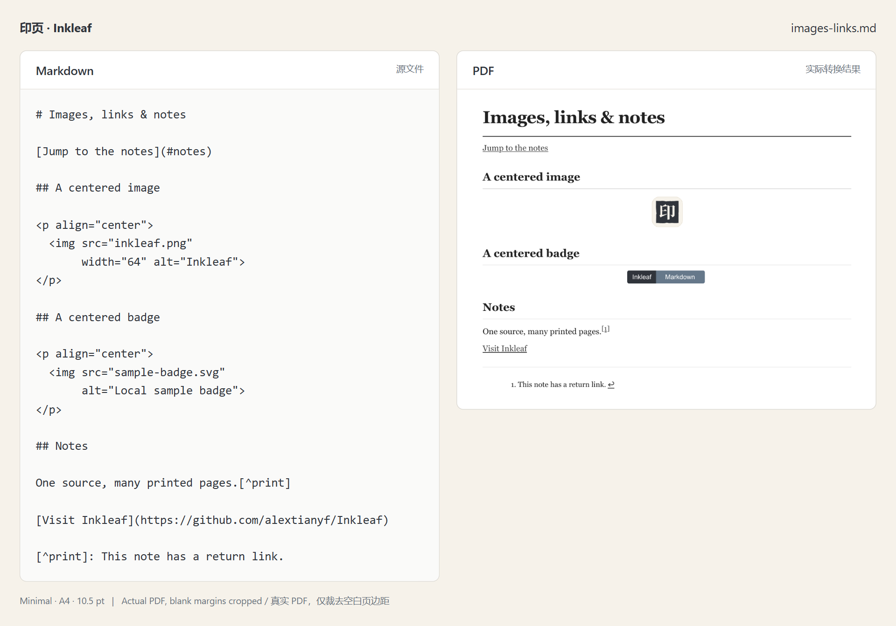

<p align="center">
  <picture>
    <source media="(prefers-color-scheme: dark)" srcset="docs/media/hero-zh-dark.png">
    
  </picture>
</p>

<p align="center">
  <a href="https://github.com/alextianyf/Inkleaf/releases/latest"><picture><source media="(prefers-color-scheme: dark)" srcset="docs/media/badges/download-zh-dark.svg"></picture></a>&nbsp;&nbsp;<a href="#quick-start"><picture><source media="(prefers-color-scheme: dark)" srcset="docs/media/badges/quick-start-zh-dark.svg"></picture></a>
</p>

<p align="center">
  <picture><source media="(prefers-color-scheme: dark)" srcset="docs/media/badges/system-windows-zh-dark.svg"></picture>&nbsp;&nbsp;<a href="docs/license.zh-CN.md"><picture><source media="(prefers-color-scheme: dark)" srcset="docs/media/badges/free-zh-dark.svg"></picture></a>
</p>

<p align="center">
  <sub>作者 <a href="https://github.com/alextianyf"><strong>Alex Tian</strong></a> &nbsp;·&nbsp; <a href="README.md">English</a> · <strong>简体中文</strong> &nbsp;·&nbsp; <a href="docs/todo.md">后续计划</a> &nbsp;·&nbsp; <a href="https://github.com/alextianyf/Inkleaf/issues">反馈问题</a></sub>
</p>

## 一小块空间，完成一份 PDF

印页是一个 Windows 桌面工具，把 Markdown 笔记、项目 README 和技术文档转换为 PDF。按下快捷键，搜索文件，检查排版，再导出。无需账号、订阅或上传文档。

**语言支持：** 界面支持简体中文与英文；Markdown 文档及导出的 PDF 支持中文、英文和中英混排。

[](docs/media/demo-zh.png)

<p align="center"><sub>使用示例文档在真实应用中录制。<a href="docs/media/demo-zh.png">查看静态预览</a>。</sub></p>

## 印页能做什么

| 需求         | 使用体验                                                                                         |
| ------------ | ------------------------------------------------------------------------------------------------ |
| **找到文档** | 输入部分文件名或路径即可搜索，结果会区分 Markdown 文件和包含 Markdown 的文件夹。                 |
| **先看成品** | 预览实际生成的 PDF，检查分页、点击目录跳转。导出使用的就是这份 PDF 数据。                        |
| **保留细节** | 渲染公式、表格、图片、对齐的徽章、任务列表与脚注。缺失资源及部分不支持的内容会显示提示。         |
| **整批转换** | 选择文件夹中的 Markdown，逐份检查并批量导出。可保留子目录，自动保存时为同名 PDF 编号，避免覆盖。 |
| **调整排版** | Folio（默认）、Classic 与 Minimal 三套主题，支持纸张、标题样式、分页、页眉页脚与署名版权设置。                  |
| **留在本机** | 转换不改写 Markdown 原文件。PDF 可保存到下载文件夹、原文件旁，或你指定的位置。                   |

## 为什么选择印页？

- **个人非商业使用免费。** 此类使用无需订阅、购买转换额度或注册账号。公司及其他商业用途需另行书面授权，费用另议。[许可说明](docs/license.zh-CN.md)。
- **文档不离开本机。** 本地转换，不改写 Markdown 原文件；使用本地资源的文档与公式可离线处理，只有远程图片和更新检查需要联网。
- **快速查找文件。** 已有 Windows 基准测试中，查询 **10 万个已索引 Markdown 文件，中位耗时约 23 ms**。首次扫描、启动和界面显示另计。[测试数据与限制](docs/search.md)。
- **界面简单，步骤少。** 唤起搜索栏、选择文件、查看预览；不用时收在系统托盘里。

## Markdown 变成 PDF，是什么样子？

下面左侧是 **Markdown 原文**，右侧是**印页实际生成的 PDF**，统一使用简约主题、A4 纸张和 10.5 pt 正文字号。图片仅裁去空白页边距；点击可放大，下载 PDF 可体验其中的链接。

### 标题与文字

一级至六级标题、**粗体**、_斜体_、删除线、中英混排和引用段落。

[](docs/media/examples/typography.png)

[Markdown 原文](docs/demo/examples/typography.md) · [实际 PDF](docs/media/examples/typography.pdf)

### 代码与公式

代码保留文字与缩进，并按语言为关键字、字符串、注释等着色。KaTeX 渲染行内公式、积分与分式。

[](docs/media/examples/code-math.png)

[Markdown 原文](docs/demo/examples/code-math.md) · [实际 PDF](docs/media/examples/code-math.pdf)

### 表格与列表

表格的左、中、右对齐，已完成和未完成任务，以及有序步骤和嵌套无序列表。PDF 中的任务复选框为静态显示。

[](docs/media/examples/tables-lists.png)

[Markdown 原文](docs/demo/examples/tables-lists.md) · [实际 PDF](docs/media/examples/tables-lists.pdf)

### 图片、徽章与链接

本地图片和 SVG 徽章遵循父段落的居中设置。PDF 包含文内跳转、外部链接，以及带返回链接的脚注。

[](docs/media/examples/images-links.png)

[Markdown 原文及本地图片](docs/demo/examples/) · [实际 PDF](docs/media/examples/images-links.pdf)

这些示例展示已支持的内容，并不代表兼容所有 Markdown 方言。尚未支持的扩展与排版限制见[兼容性说明](docs/engine.md)。

## 获取印页

**[下载 Windows 安装包（x64）](https://github.com/alextianyf/Inkleaf/releases/latest)** · [发布说明](https://github.com/alextianyf/Inkleaf/releases/latest)

当前正式版本为 **0.4.11**。点击上方链接下载 `.exe` 安装包，也可以[从源码运行](#development)。发布页中的 `.blockmap` 与 `latest.yml` 供更新器使用，手动安装只需下载 `.exe`。

安装包自带运行环境，无需另外安装 Node.js 或 Python。目前不提供 macOS 和 Linux 版本，Windows 构建尚未进行代码签名。上文展示的部分排版与高亮改进只存在于当前源码中，0.4.11 已包含的功能以发布说明为准。

安装版会检查新的稳定版本。发现更新后，点击**下载**，准备好后再选择**重启并更新**。有转换或导出任务时会等待完成；普通退出不会自动安装。[更新与发布说明](docs/updates.md)。

<a id="quick-start"></a>

## 生成第一份 PDF

1. 启动印页，按 **Ctrl + Shift + Space** 唤起搜索栏。
2. 输入部分 Markdown 文件名，选中结果后按 **Enter**。
3. 检查 PDF 预览，点击**导出 PDF**，默认保存到下载文件夹。

选中文件夹结果可准备批量转换。按 **Esc** 收起搜索栏；右键**系统托盘图标**可打开设置或退出应用。

设置分为**通用、搜索、排版、导出、关于与更新**。排版使用固定示例文档实时预览，普通设置自动保存；排版需要点击“保存排版”，未保存时离开会提示。[完整设置说明](docs/settings.md)。

## 你可能想知道

<details>
<summary><strong>搜索范围是什么？</strong></summary>

搜索本地 Markdown 文件名、路径，以及包含已索引 Markdown 的文件夹。首次扫描需要时间，文件会随扫描进度逐步出现。可在设置中添加目录或排除位置。目前不支持正文、拼音或拼写纠错搜索。

</details>

<details>
<summary><strong>断网可以用吗？</strong></summary>

使用本地资源的文档可以离线转换，公式渲染及其字体已随应用提供。远程图片和徽章在获取时需要联网，更新检查会连接 GitHub。文档本身不会上传到服务器进行转换。

</details>

<details>
<summary><strong>所有 Markdown 扩展都支持吗？</strong></summary>

支持常见 Markdown 及部分扩展，包括 KaTeX 公式和脚注。尚未实现 Mermaid、PlantUML、Obsidian 双链。复杂 HTML/CSS、过宽的表格和公式仍可能需要调整。[支持范围与限制](docs/engine.md)。

</details>

<details>
<summary><strong>会修改我的原文件吗？</strong></summary>

不会。转换只读取 Markdown。有限的格式修复在内存中完成，并显示修改提示；它不能自动修复所有 Markdown 问题。[文档检测说明](docs/source-checks.md)。

</details>

## 名字的由来

一块印版，可以反复印刷。一份 Markdown，也可以反复成页。

灵感来自中国传统印刷术，**印页**将印刷的过程与完成的纸页连在一起。**Inkleaf** 则由墨（ink）与纸页（leaf）组成。继续用 Markdown 写作，需要分享时，就印成一份 PDF。

## 还在打磨的地方

转换流程已经实现，桌面体验仍在完善。当前源码已加入对称尺寸调整、大幅排版预览与明确的保存、更改反馈。后续会继续打磨 PDF 美观性和搜索，详见[后续计划](docs/todo.md)。

如果遇到渲染问题，欢迎[提交反馈](https://github.com/alextianyf/Inkleaf/issues)，附上应用版本、Windows 版本、最小 Markdown 示例和预期效果。分享前请移除私人信息。

## 使用许可

版权所有 © 2026 **Alex Tian**。印页使用自定义的[个人非商业使用许可](docs/license.zh-CN.md)，不是 MIT。个人在不涉及经济利益或商业优势的情况下免费使用；公司内部使用、收费教学、转售和收费服务等商业用途，需提前取得书面授权，费用另议。

你的 Markdown 和生成的 PDF 仍归你，许可不要求在 PDF 中加入水印。第三方组件继续适用各自许可。商业授权请通过 [Alex Tian 的主页](https://github.com/alextianyf)所列联系方式联系；完整条款以 [LICENSE](LICENSE) 为准。

<a id="development"></a>

## 技术与开发

**Electron 与 React** 构建桌面应用，**Markdown-it** 解析文档，**KaTeX** 渲染公式，**Chromium** 生成 PDF，**PDF.js** 显示预览，**highlight.js** 提供代码着色。更新由 **electron-updater** 与 GitHub Releases 提供。

从源码运行桌面版，需要 Node.js 22.12 或更新版本：

```sh
git clone https://github.com/alextianyf/Inkleaf.git
cd Inkleaf
npm ci
npm run dev
```

这会启动 **Inkleaf Dev**，使用独立设置和默认快捷键 **Ctrl + Alt + Shift + Space**，可以与已安装的正式版同时运行。如果 PowerShell 拦截 `npm` 脚本，请改用 `npm.cmd`。

桌面版已合并到 `main`，早期版本保存在 `aldusV1` 分支。[开发与发版命令速查](docs/commands.md) · [开发与构建](docs/development.md) · [项目结构](docs/architecture.md)。

---

<p align="center">
  <sub>印页 · Inkleaf · 让文字成页。</sub><br>
  <sub><a href="resources/icons/README.md">品牌资产</a> · <a href="docs/engine.md">Markdown 支持范围</a> · <a href="https://github.com/alextianyf/Inkleaf/issues">反馈问题</a></sub>
</p>
