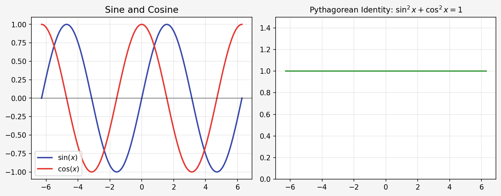
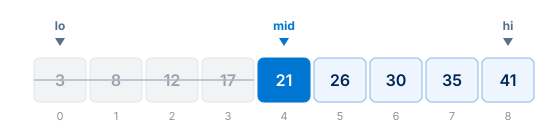

<!--
Inkleaf quality template. Every construct the converter supports, in one
document, so a single run shows how each theme handles all of it.

  npm run check:quality              all themes, English and Chinese UI
  npm run check:grayscale            the same document in black and white

The checker confirms each marker below survives into the PDF text. When you
add a section, add its marker here too.
-->
<!-- quality-markers: QC-START, QC-HEADING-SIX, QC-INLINE, QC-LINKS, QC-LIST-DEEP, QC-LIST-LOOSE, QC-TASK, QC-QUOTE, QC-QUOTE-NESTED, QC-CALLOUT-NOTE, QC-CALLOUT-TIP, QC-CALLOUT-IMPORTANT, QC-CALLOUT-WARNING, QC-CALLOUT-CAUTION, QC-CALLOUT-UNKNOWN, QC-CODE-PY, QC-CODE-SHORT, QC-CODE-PLAIN, QC-CODE-LONG-LAST, QC-MATH, QC-TABLE, QC-TABLE-WIDE, QC-TABLE-ROW-40, QC-HTML-TABLE, QC-FIGURE, QC-IMAGE-INLINE, QC-BADGES, QC-HTML, QC-DETAILS, QC-FOOTNOTE-ONE, QC-FOOTNOTE-TWO, QC-CJK, QC-END -->

# Inkleaf quality template

A single document that exercises every Markdown and HTML construct Inkleaf converts. Marker QC-START.

<div class="toc">
<strong>Contents</strong>
<ol>
<li><a href="#1-headings-and-text">Headings and text</a></li>
<li><a href="#2-links-and-references">Links and references</a></li>
<li><a href="#3-lists">Lists</a></li>
<li><a href="#4-quotations-and-callouts">Quotations and callouts</a></li>
<li><a href="#5-code">Code</a></li>
<li><a href="#6-mathematics">Mathematics</a></li>
<li><a href="#7-tables">Tables</a></li>
<li><a href="#8-images-and-figures">Images and figures</a></li>
<li><a href="#9-html">HTML</a></li>
<li><a href="#10-中文排版">中文排版</a></li>
</ol>
</div>

## 1 Headings and text

### Level three heading

#### Level four heading

##### Level five heading

###### Level six heading QC-HEADING-SIX

### A heading with **bold**, _italic_, `code` and a [link](#1-headings-and-text)

### A deliberately long heading that has to wrap onto a second line, so its balance and the spacing below it can be checked

Plain paragraph text, long enough to wrap across several lines so the measure, line spacing and paragraph rhythm are visible. A second sentence keeps going so the right edge shows how ragged it is, and a third one finishes the thought.

Inline styles: **bold**, _italic_, **_bold italic_**, ~~strikethrough~~, `inline_code()`, H<sub>2</sub>O, x<sup>2</sup>, <kbd>Ctrl</kbd> + <kbd>K</kbd>, <mark>highlighted</mark>, <u>underlined</u>, <small>small text</small>, <ins>inserted</ins>, <del>deleted</del> and <abbr title="Portable Document Format">PDF</abbr>. Marker QC-INLINE.

Code containing a backtick: ``a`b``. Escaped characters: \*not italic\*, \# not a heading, \`not code\`. Entities: &copy; &mdash; &rarr; &plusmn; &times;.

Symbols and scripts: café, naïve, Straße, Ελληνικά, Привет, ≤ ≥ ≠ ± × ÷ → ∞, 25 °C, 3 µm, emoji ✅ 📘.

A hard break with two trailing spaces ends this line.  
This line continues the same paragraph.\
So does this one, after a backslash break.

An unbreakable word: Donaudampfschifffahrtsgesellschaftskapitänswitwe. An unbreakable address: https://example.com/library/physics/waves-and-optics/chapters/standing-waves/experiments/results.md

---

## 2 Links and references

External link: [Inkleaf on GitHub](https://github.com/alextianyf/Inkleaf). Reference-style link: [CommonMark][commonmark]. Bare URL made clickable: https://spec.commonmark.org/. Email: <hello@example.com>. Internal link back to [the lists](#3-lists). Footnotes: one[^one], two[^two], and the first again[^one]. Marker QC-LINKS.

[commonmark]: https://spec.commonmark.org/ "CommonMark specification"

## 3 Lists

- First level item.
- A longer first level item that wraps onto a second line, so the continuation aligns with the text rather than with the bullet marker.
  - Second level item.
    - Third level item. Marker QC-LIST-DEEP.
  - Back to the second level.
- Back to the first level.

5. An ordered list that starts at five.
6. It can hold a nested list:
   - nested bullet one;
   - nested bullet two.
7. And continues its numbering.

- A loose list item with two paragraphs.

  The second paragraph belongs to the same item. Marker QC-LIST-LOOSE.

- A loose item containing a code block:

  ```python
  print("inside a list")
  ```

- **Term** — a definition written as a list item, a common pattern in handouts.
- **Another term** — its definition.

- [x] Completed task.
- [ ] Open task. Marker QC-TASK.
  - [x] Nested completed task.
  - [ ] Nested open task.

## 4 Quotations and callouts

> A plain quotation. It can run over several lines and still read as one block. Marker QC-QUOTE.

> **Key idea:** a quotation that opens with a bold label.

> An outer quotation.
>
> > A nested quotation inside it. Marker QC-QUOTE-NESTED.
>
> - A list inside a quotation.
> - Second item.

> [!NOTE]
> Background the reader can skip. Marker QC-CALLOUT-NOTE.

> [!TIP]
> A callout can hold lists and code. Marker QC-CALLOUT-TIP.
>
> - first point;
> - second point.
>
> ```python
> print("inside a callout")
> ```

> [!IMPORTANT]
> The one idea to remember, with **bold** and `code` inside. Marker QC-CALLOUT-IMPORTANT.

> [!WARNING]
> Something that goes wrong quietly. Marker QC-CALLOUT-WARNING.

> [!CAUTION] The marker can also sit on the same line as the text. Marker QC-CALLOUT-CAUTION.

> [!SUMMARY]
> An unknown marker stays a plain quotation. Marker QC-CALLOUT-UNKNOWN.

## 5 Code

A labelled block of five or more lines is numbered:

```python
from pathlib import Path


def count_words(folder: Path) -> dict[str, int]:
    """Count the words in every Markdown file."""  # QC-CODE-PY
    totals = {}
    for source in sorted(folder.glob("*.md")):
        totals[source.name] = len(source.read_text("utf8").split())
    return totals
```

A short block is not numbered:

```javascript
const theme = "modern"; // QC-CODE-SHORT
```

`numbers` forces numbering on a short block:

```bash numbers
npm run build:ui
npm run check:quality
```

`nonumbers` turns it off on a long block:

```text nonumbers
check_headings ......... ok
check_lists ............ ok
check_tables ........... ok
check_code ............. ok
check_math ............. ok
```

A block without a language keeps its text exactly and has no label:

```
+---------------------------+
|  INKLEAF  /  QC-CODE-PLAIN |
+---------------------------+
tabs	stay	aligned
```

Other languages:

```json
{ "theme": "modern", "pageNumbers": true, "fontSize": 10.5 }
```

```sql
SELECT title, page_count FROM documents WHERE page_count >= 10 ORDER BY title;
```

```diff
- const theme = "classic";
+ const theme = "modern";
  exportDocument(theme);
```

```html
<p align="center"></p>
```

```css
.note { border-left: 3px solid #0076d3; padding: 8px 12px; }
```

```yaml
theme: modern
languages: [en, zh]
```

A long line wraps instead of leaving the page:

```python
result = some_function_with_a_long_name(first_argument, second_argument, third_argument, keyword_argument="a long string value that keeps going")
```

A block longer than a page splits across pages and keeps its numbering:

```python
"""Build a weekly practice sheet from a list of topics."""

import random
from dataclasses import dataclass


@dataclass
class Question:
    topic: str
    level: int
    text: str


TOPICS = [
    "arrays",
    "binary search",
    "sorting",
    "recursion",
    "stacks",
    "queues",
    "hash tables",
    "trees",
    "heaps",
    "graphs",
    "breadth-first search",
    "depth-first search",
    "dynamic programming",
    "greedy methods",
    "strings",
    "bit tricks",
]


def make_question(topic: str, level: int) -> Question:
    """Return one question for a topic at a difficulty level."""
    stem = f"Explain how {topic} works"
    if level >= 3:
        stem += " and analyse its running time"
    return Question(topic, level, stem + ".")


def build_sheet(count: int, seed: int = 7) -> list[Question]:
    """Pick topics at random, easy ones first."""
    rng = random.Random(seed)
    chosen = rng.sample(TOPICS, k=min(count, len(TOPICS)))
    levels = sorted(rng.randint(1, 4) for _ in chosen)
    return [make_question(t, lv) for t, lv in zip(chosen, levels)]


def render(sheet: list[Question]) -> str:
    lines = ["# Practice sheet", ""]
    for number, question in enumerate(sheet, start=1):
        lines.append(f"{number}. [{question.level}] {question.text}")
    return "\n".join(lines)


if __name__ == "__main__":
    sheet = build_sheet(8)
    print(render(sheet))
    print("QC-CODE-LONG-LAST")
```

## 6 Mathematics

Inline mathematics sits in the line: $E = mc^2$, $\alpha, \beta, \theta$, $x_i^2$, $\sqrt{2}$, $\frac{a}{b}$ and $x \in \mathbb{R}$. Marker QC-MATH.

$$
x = \frac{-b \pm \sqrt{b^2 - 4ac}}{2a}
\qquad
\sum_{k=1}^{n} k = \frac{n(n+1)}{2}
\qquad
\int_0^1 x^2 \, dx = \frac{1}{3}
$$

$$
\begin{aligned}
f(x) &= (x + 1)^2 \\
     &= x^2 + 2x + 1
\end{aligned}
\qquad
A = \begin{bmatrix} 1 & 2 \\ 3 & 4 \end{bmatrix}
\qquad
|x| = \begin{cases} x, & x \geq 0 \\ -x, & x < 0 \end{cases}
$$

$$
\lim_{n \to \infty} \left(1 + \frac{1}{n}\right)^n = e
\qquad
\binom{n}{k} = \frac{n!}{k!\,(n-k)!}
\qquad
\boxed{v = f\lambda}
$$

## 7 Tables

| Left       | Centre |  Right | Formatting                    |
| :--------- | :----: | -----: | ----------------------------- |
| Alpha      |   1    |   0.25 | **bold** and _italic_         |
| Beta       |   22   |  12.50 | `code` in a cell              |
| Gamma      |  333   | 125.00 | [a link](#7-tables) and $x^2$ |
| Empty cell |        |   0.00 | Marker QC-TABLE               |

A cell with a long explanation wraps inside its column:

| Item    | Explanation                                                                                                                                              |
| ------- | -------------------------------------------------------------------------------------------------------------------------------------------------------- |
| Padding | A long explanation that wraps onto several lines, so the padding, line spacing and vertical alignment of the cell can be checked against its neighbours. |
| Short   | One line.                                                                                                                                                |

Many narrow columns of figures:

| Q   |   Mon |   Tue | Wed | Thu | Fri | Sat |           Sun |
| --- | ----: | ----: | --: | --: | --: | --: | ------------: |
| A   |    12 |     7 |  31 |   4 |  18 |   2 |             9 |
| B   | 1,024 |    88 |   5 | 640 |  13 |  71 |           300 |
| C   |     3 | 1,500 |  42 |   8 | 256 |  19 | QC-TABLE-WIDE |

A long table continues across pages and repeats its header:

| No. | Measurement | Value | Status          |
| --: | :---------- | ----: | :-------------- |
|  01 | Trial 1     |  0.31 | Checked         |
|  02 | Trial 2     |  0.32 | Checked         |
|  03 | Trial 3     |  0.33 | Repeated        |
|  04 | Trial 4     |  0.34 | Checked         |
|  05 | Trial 5     |  0.35 | Checked         |
|  06 | Trial 6     |  0.36 | Repeated        |
|  07 | Trial 7     |  0.37 | Checked         |
|  08 | Trial 8     |  0.38 | Checked         |
|  09 | Trial 9     |  0.39 | Repeated        |
|  10 | Trial 10    |  0.40 | Checked         |
|  11 | Trial 11    |  0.41 | Checked         |
|  12 | Trial 12    |  0.42 | Repeated        |
|  13 | Trial 13    |  0.43 | Checked         |
|  14 | Trial 14    |  0.44 | Checked         |
|  15 | Trial 15    |  0.45 | Repeated        |
|  16 | Trial 16    |  0.46 | Checked         |
|  17 | Trial 17    |  0.47 | Checked         |
|  18 | Trial 18    |  0.48 | Repeated        |
|  19 | Trial 19    |  0.49 | Checked         |
|  20 | Trial 20    |  0.50 | Checked         |
|  21 | Trial 21    |  0.51 | Repeated        |
|  22 | Trial 22    |  0.52 | Checked         |
|  23 | Trial 23    |  0.53 | Checked         |
|  24 | Trial 24    |  0.54 | Repeated        |
|  25 | Trial 25    |  0.55 | Checked         |
|  26 | Trial 26    |  0.56 | Checked         |
|  27 | Trial 27    |  0.57 | Repeated        |
|  28 | Trial 28    |  0.58 | Checked         |
|  29 | Trial 29    |  0.59 | Checked         |
|  30 | Trial 30    |  0.60 | Repeated        |
|  31 | Trial 31    |  0.61 | Checked         |
|  32 | Trial 32    |  0.62 | Checked         |
|  33 | Trial 33    |  0.63 | Repeated        |
|  34 | Trial 34    |  0.64 | Checked         |
|  35 | Trial 35    |  0.65 | Checked         |
|  36 | Trial 36    |  0.66 | Repeated        |
|  37 | Trial 37    |  0.67 | Checked         |
|  38 | Trial 38    |  0.68 | Checked         |
|  39 | Trial 39    |  0.69 | Repeated        |
|  40 | Trial 40    |  0.70 | QC-TABLE-ROW-40 |

An HTML table with merged cells, a set width and centring:

<table align="center" style="width:70%">
  <thead><tr><th rowspan="2">Group</th><th colspan="2">Result</th></tr><tr><th>Before</th><th>After</th></tr></thead>
  <tbody>
    <tr><td>First</td><td align="right">12.5</td><td align="right">14.0</td></tr>
    <tr><td>Second</td><td colspan="2" align="center">QC-HTML-TABLE</td></tr>
  </tbody>
</table>

## 8 Images and figures

A Markdown image alone in its paragraph is a figure:



_Figure 1. A raster image with a caption underneath. Marker QC-FIGURE._

An author-centred vector figure at a set width:

<p align="center"></p>

_Figure 2. A vector image._

A sized image sits in a line of text:  like this. Marker QC-IMAGE-INLINE.

A row of badges stays on one line:

<p align="center">  <a href="https://example.com"></a></p>

<p align="center"><small>Marker QC-BADGES</small></p>

## 9 HTML

<div align="center">A centred block of text.</div>

<p align="right">A right-aligned paragraph.</p>

<p style="color:#7c3e20">An author colour survives the theme. Marker QC-HTML.</p>

Text with a line<br>break from HTML.

<details><summary>A disclosure is printed open</summary>

The body of a disclosure is always visible in a PDF. Marker QC-DETAILS.

- It can hold a list.

</details>

<div style="break-before: page"></div>

## 10 中文排版

中文段落需要检查标点、中西文混排和数字：使用 Inkleaf 把 Markdown 转为 PDF，当前版本 0.5.1，共 12 页。引号“这样”、书名号《讲义》、破折号——以及省略号……都应正常显示。标记 QC-CJK。

**加粗**、_斜体_（中文没有真正的斜体，应保持正体）、`行内代码`、[链接](#10-中文排版) 都要清楚可辨。

### 三级标题

#### 四级标题

- 第一项；
- 第二项，文字较长，需要换行，检查续行是否与首行文字对齐，而不是与项目符号对齐。
  - 嵌套项。

1. 有序第一项；
2. 有序第二项。

> [!IMPORTANT]
> 中文标注块。标签随界面语言显示为“重点”或 “Key idea”。

> 普通中文引用。

| 项目 | 说明               | 数值 |
| :--- | :----------------- | ---: |
| 标题 | 六级标题层级清楚   |    6 |
| 表格 | 中文单元格换行正常 | 12.5 |

```python
def 平均值(数据):
    """中文注释与标识符。"""
    return sum(数据) / len(数据)
```

---

Footnote text follows. Marker QC-END.

[^one]: The first footnote. It is referenced twice. Marker QC-FOOTNOTE-ONE.

[^two]: The second footnote has two paragraphs.

    This is its second paragraph. Marker QC-FOOTNOTE-TWO.
